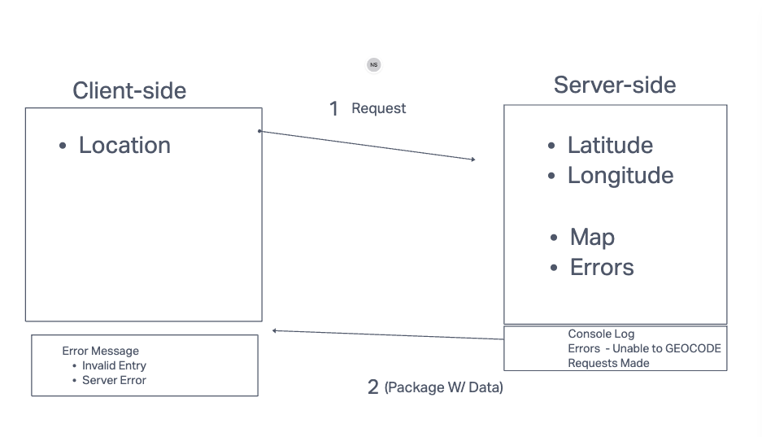

# Project Name

**Author**: Nika Skeba
**Version**: 1.0.0 (increment the patch/fix version number if you make more commits past your first submission)

## Overview
User will Enter City - Server side will use API to extract latitude, longitute and send back info as well as a map and any error messages relevant to user. Log all errors in server log.

## Getting Started
<!-- What are the steps that a user must take in order to build this app on their own machine and get it running? -->

## Architecture
React, LocationIQ API - https://locationiq.com/docs#search-forward-geocoding

## Change Log
<!-- Use this area to document the iterative changes made to your application as each feature is successfully implemented. Use time stamps. Here's an example:

01-01-2001 4:59pm - Application now has a fully-functional express server, with a GET route for the location resource. -->

## Credit and Collaborations
<!-- Give credit (and a link) to other people or resources that helped you build this application. -->
